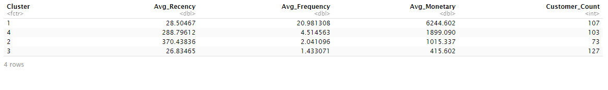

## 🎯Project Goal: Segmenting E-Commerce Customers
The objective is to analyze a customer dataset to identify distinct groups or segments based on their purchasing behavior. The insights from this analysis will help the marketing team create targeted campaigns, improve customer retention, and personalize user experience. 

---
## Technologies Used
- Programming Language: R

- Core Libraries: tidyverse (for data manipulation and visualization), cluster, factoextra (for clustering)

- Dataset:simulated data

- IDE: RStudio

----
## Step 1: Exploratory Data Analysis (EDA) & Preprocessing
Before clustering, understand and prepare data. This is where the tidyverse shines.

Load and Clean Data:
```
# Load necessary libraries
library(tidyverse)
library(cluster)
library(factoextra)

# Load data
rfm_data <- read_csv("your_rfm_data.csv")

# Inspect the data
glimpse(rfm_data)
summary(rfm_data)

# Check for missing values and remove any if necessary
rfm_data <- na.omit(rfm_data)

# Remove any logical inconsistencies (e.g., MonetaryValue <= 0)
rfm_data_clean <- rfm_data %>%
  filter(MonetaryValue > 0)
```
## Visualize Distributions: 
Check for outliers and skewness in the RFM variables using ggplot2. Highly skewed data can distort clusters. 
```
# Plot distribution of Monetary value
ggplot(rfm_data_clean, aes(x = MonetaryValue)) +
  geom_histogram(bins = 30, fill = "skyblue", color = "black") +
  ggtitle("Distribution of Monetary Value")
```


- **Highly skewed, Applied a log transform.**
```
rfm_data_clean$MonetaryLog <- log(rfm_data_clean$MonetaryValue)
```
- **Scale the Data: K-Means is sensitive to the scale of variables. A feature with a large range (like Monetary) will dominate others (like Frequency). Scaling is mandatory.** 
```
# Select only the columns for clustering
rfm_for_clustering <- rfm_data_clean %>%
  select(Recency, Frequency, MonetaryLog)

# Scale the data (z-score normalization)
rfm_scaled <- scale(rfm_for_clustering)
```
---
## Step 2: Determine the Optimal Number of Clusters (K)
- **Elbow Method:** Calculates the variance explained as a function of the number of clusters. Look for an "elbow" in the plot where adding more clusters doesn't significantly improve the model.
```
# Use fviz_nbclust to find and visualize the optimal number of clusters
fviz_nbclust(rfm_scaled, kmeans, method = "wss") +
  labs(subtitle = "Elbow Method")
```


----
- **Silhouette Method:** Measures how similar a data point is to its own cluster compared to other clusters. A higher average silhouette width indicates better-defined clusters.
```
fviz_nbclust(rfm_scaled, kmeans, method = "silhouette") +
  labs(subtitle = "Silhouette Method")
```


## Step 3: Build and Visualize the K-Means Model
```
# Set a seed for reproducibility
set.seed(123)

# Perform k-means clustering with k = 4
km_result <- kmeans(rfm_scaled, centers = 4, nstart = 25)
```
- **Visualize the Clusters:** `factoextra` makes it easy to create a polished visualization of the clusters. It automatically performs dimensionality reduction (like PCA) to plot the clusters in 2D.


## Step 4: Profile and Interpret the Segments
**What does each segment mean?**
Add Cluster Assignments to Original Data: Add the cluster number back to non-scaled data to interpret the results.
```
rfm_data_clean$Cluster <- as.factor(km_result$cluster)
```
- **Analyze Segment Characteristics:** Use `dplyr` to group by cluster and calculate the average Recency, Frequency, and Monetary value for each segment.
```
cluster_summary <- rfm_data_clean %>%
  group_by(Cluster) %>%
  summarise(
    Avg_Recency = mean(Recency),
    Avg_Frequency = mean(Frequency),
    Avg_Monetary = mean(MonetaryValue),
    Customer_Count = n()
  ) %>%
  arrange(desc(Avg_Monetary))

print(cluster_summary)
```
- **Recency:** How recently a customer made a purchase.

- **Frequency:** How often they make purchases.

- **Monetary:** The total amount of money they've spent.
---


## 🏷️Personas of Clusters: 

- **Cluster 1** (High Avg_Monetary, High Avg_Frequency, Low Avg_Recency): "Champions" or "Loyal High-Spenders"

- **Cluster 2** (Low Avg_Monetary, Low Avg_Frequency, High Avg_Recency): "At-Risk" or "Churning Customers"

- **Cluster 3** (Low Avg_Recency, High Avg_Frequency): "Recent & Frequent Shoppers"

- **Cluster 4** (High Avg_Recency, Low Avg_Frequency): "New or One-Time Buyers"

---
## 🎬 Actionable Recommendations: Targeted marketing action.

- **Champions:** Reward them with a loyalty program.

- **At-Risk:** Target them with a re-engagement campaign or a special offer.

- **New Buyers:** Nurture them with onboarding emails to encourage a second purchase.

## 💡 Versatile Industry Applications
While this project uses an e-commerce dataset, its core framework for customer segmentation is highly adaptable and can provide significant value across numerous sectors. The fundamental principle is to group entities (customers, users, patients, etc.) based on behavioral data to enable more effective, targeted strategies.

By replacing the RFM (Recency, Frequency, Monetary) metrics with industry-specific data points, this analysis can unlock powerful insights in areas like:

- **Finance & Banking 🏦:** Segment clients by transaction frequency, account balances, and credit usage to offer personalized loan products, identify candidates for wealth management, or detect early signs of churn.

- **Subscription Services (SaaS & Streaming) 💻:** Group users by login frequency, feature adoption rates, and content consumption patterns to identify power users for feedback, predict accounts at risk of cancellation, and create targeted onboarding campaigns.

- **Higher Education 🎓:** Segment students by LMS engagement, attendance, and academic performance to proactively identify at-risk individuals. This allows institutions to deploy targeted support, like advising or tutoring, to prevent students from falling behind or dropping out.

- **Healthcare 🏥:** Cluster patients based on appointment history, treatment adherence, and health metrics to identify at-risk populations that would benefit from proactive outreach programs and personalized care plans.

- **Telecommunications 📱:** Analyze customers by data usage, plan type, and customer support interactions to offer strategic plan upgrades, improve network resource allocation, and enhance customer retention.

Ultimately, any organization that collects user data can leverage this K-Means clustering approach to better understand its audience and make smarter, data-driven decisions.

