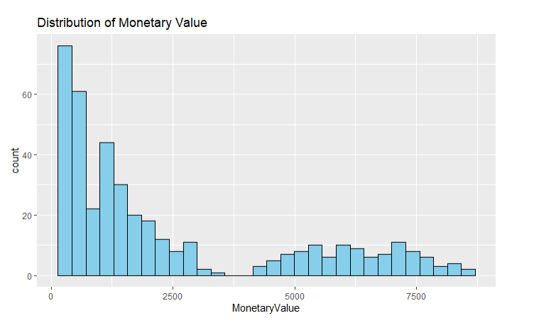
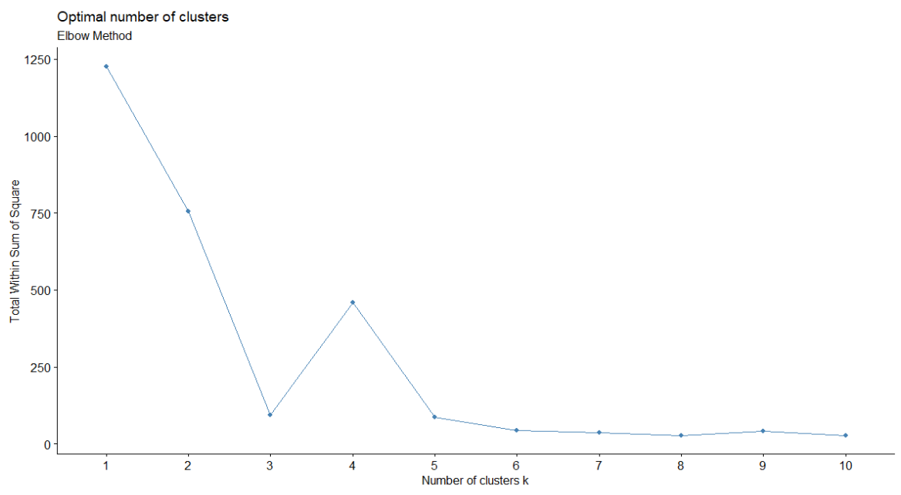
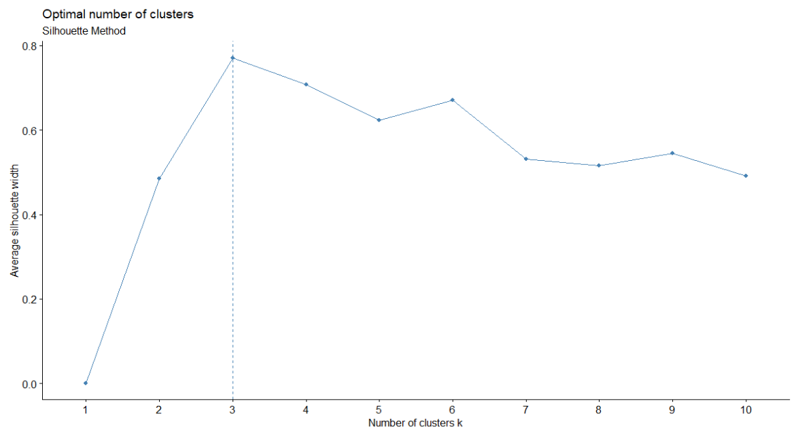
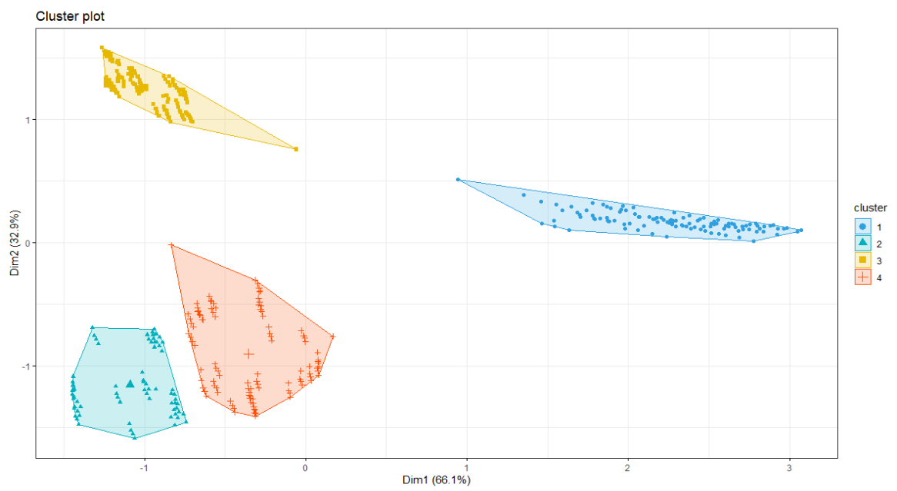

## Project Goal: Segmenting E-Commerce Customers
The objective is to analyze a customer dataset to identify distinct groups or segments based on their purchasing behavior. The insights from this analysis will help the marketing team create targeted campaigns, improve customer retention, and personalize user experience. 🎯

---
## Technologies Used
- Programming Language: R

- Core Libraries: tidyverse (for data manipulation and visualization), cluster, factoextra (for clustering)

- Dataset:simulated data

- IDE: RStudio

----
## Step 1: Exploratory Data Analysis (EDA) & Preprocessing
Before clustering, you must understand and prepare your data. This is where the tidyverse shines.

Load and Clean Data:
```
# Load necessary libraries
library(tidyverse)
library(cluster)
library(factoextra)

# Load your data
rfm_data <- read_csv("your_rfm_data.csv")

# Inspect the data
glimpse(rfm_data)
summary(rfm_data)

# Check for missing values and remove any if necessary
rfm_data <- na.omit(rfm_data)

# Remove any logical inconsistencies (e.g., MonetaryValue <= 0)
rfm_data_clean <- rfm_data %>%
  filter(MonetaryValue > 0)
```
## Visualize Distributions: 
Check for outliers and skewness in your RFM variables using ggplot2. Highly skewed data can distort clusters. 
```
# Plot distribution of Monetary value
ggplot(rfm_data_clean, aes(x = MonetaryValue)) +
  geom_histogram(bins = 30, fill = "skyblue", color = "black") +
  ggtitle("Distribution of Monetary Value")
```


# Highly skewed, Applied a log transform.
```
rfm_data_clean$MonetaryLog <- log(rfm_data_clean$MonetaryValue)
```
---
## Step 2: Determine the Optimal Number of Clusters (K)
- Elbow Method: Calculates the variance explained as a function of the number of clusters. Look for an "elbow" in the plot where adding more clusters doesn't significantly improve the model.
```
# Use fviz_nbclust to find and visualize the optimal number of clusters
fviz_nbclust(rfm_scaled, kmeans, method = "wss") +
  labs(subtitle = "Elbow Method")
```


----
- Silhouette Method: Measures how similar a data point is to its own cluster compared to other clusters. A higher average silhouette width indicates better-defined clusters.
```
fviz_nbclust(rfm_scaled, kmeans, method = "silhouette") +
  labs(subtitle = "Silhouette Method")
```


## Step 3: Build and Visualize the K-Means Model
```
# Set a seed for reproducibility
set.seed(123)

# Perform k-means clustering with k = 4
km_result <- kmeans(rfm_scaled, centers = 4, nstart = 25)
```
- Visualize the Clusters: `factoextra` makes it easy to create a polished visualization of the clusters. It automatically performs dimensionality reduction (like PCA) to plot the clusters in 2D.



## Step : Profile and Interpret the Segments
What does each segment mean?
Add Cluster Assignments to Original Data: Add the cluster number back to your non-scaled data to interpret the results.
```
rfm_data_clean$Cluster <- as.factor(km_result$cluster)
```
- Analyze Segment Characteristics: Use `dplyr` to group by cluster and calculate the average Recency, Frequency, and Monetary value for each segment.
```
cluster_summary <- rfm_data_clean %>%
  group_by(Cluster) %>%
  summarise(
    Avg_Recency = mean(Recency),
    Avg_Frequency = mean(Frequency),
    Avg_Monetary = mean(MonetaryValue),
    Customer_Count = n()
  ) %>%
  arrange(desc(Avg_Monetary))

print(cluster_summary)
```
- Recency: How recently a customer made a purchase.

- Frequency: How often they make purchases.

- Monetary: The total amount of money they've spent.

